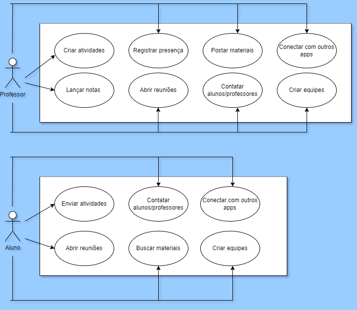
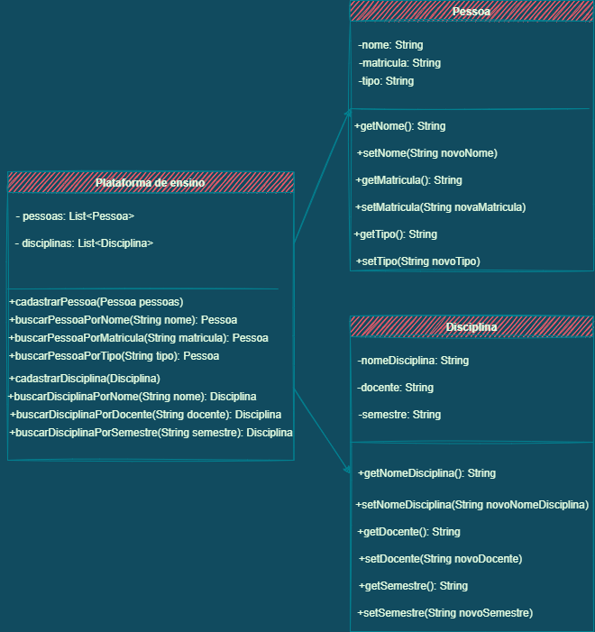

Larissa Aparecida Diniz Silva - RA: 1460482121029

<h1 align="center">Ciclo de Vida do Desenvolvimento de Software</h1>

 

  <a href="#ap">Apresentação</a>&nbsp;&nbsp;&nbsp;|&nbsp;&nbsp;&nbsp;
  <a href="#requisitos">Requisitos</a>&nbsp;&nbsp;&nbsp;|&nbsp;&nbsp;&nbsp;
  <a href="#projeto">Projeto</a>&nbsp;&nbsp;&nbsp;|&nbsp;&nbsp;&nbsp;
  <a href="#desenvolvimento">Desenvolvimento</a>&nbsp;&nbsp;&nbsp;|&nbsp;&nbsp;&nbsp;
  <a href="#dev">Dev</a>

## ✨Apresentação

A criação de um software envolve uma série de etapas a serem cumpridas e é justamente esse processo que é denominado como ciclo de vida do desenvolvimento de software. O ciclo de vida envolve o conjunto de atividades inerentes à construção de um sistema computacional. Essas atividades são agrupadas em fases, entre as quais é possível citar: definição de requisitos, análise, projeto, desenvolvimento, teste e implantação. 
 Para ilustrar esse processo, foi usado como exemplo o software de uma plataforma de ensino fictícia, e cada tópico se destinará a uma etapa específica.

  
  ## 📝Requisitos

  
Requisito é formalmente definido pelo dicionário como uma condição ou uma exigência que deve ser atendida para alcançar determinado fim. Dentro da engenharia de software, os requisitos são imprescindíveis ao longo de todo o ciclo de vida de um software, independentemente de sua natureza (marketplace, aplicativo, página web etc.). 
 Esses requisitos são divididos em duas categorias: requisitos funcionais e requisitos não funcionais.  
    <b> A) Requisitos funcionais: </b>
     
      Dizem respeito ao comportamento do software, ou seja, todas as funções e informações a serem executadas, fornecidas e tratadas por ele. Mais especificamente, guarda relação com a forma como ele deve reagir a determinadas entradas, a como ele irá se portar em determinadas situações, e até mesmo a declarar o que o sistema não deve fazer. 
 No exemplo da plataforma de ensino, ela deve ser capaz de separar os usuários em dois perfis: de professor e de aluno. O perfil do professor precisa estar apto a criar equipes, a entrar em contato com outros professores e/ou alunos, a criar reuniões, entre outras atividades. Já o perfil do aluno deve permitir a ele criar equipes, buscar outros alunos e/ou professores, buscar informações etc.  
 Repare que todos os requisitos funcionais se resumem a um verbo, a uma ação a ser executada dentro do software. 
     
 

 

 

  
   
  

  
   
  <b> B) Requisitos não funcionais: </b>
     
    
Como os <b>requisitos funcionais</b> definem tudo <b>o que</b> o sistema fará, cabem aos <b>requisitos não funcionais</b> estabelecer <b>como</b> o sistema fará, ou seja, não têm relação direta com as funções do sistema, mas as qualificam, as restringem e até mesmo as padronizam, podendo ainda exigir soluções bem específicas, daí a transversalidade desses requisitos, que muitas vezes precisam ser resolvidos no âmbito da arquitetura do software e não da programação. 
 Por esse motivo também são chamados de atributos de qualidade, já que abordam aspectos de qualidade importantes em sistemas de software. Portanto, a não observância dos requisitos não funcionais pode levar à inconsistência e baixa qualidade do software. 
 Os requisitos não funcionais da plataforma de ensino fictícia foram baseados nas 10 heurísticas de Nielsen, que são regras gerais de usabilidade com foco na fluidez e intuitividade. 
     
 

 

 
 

  
  

→ [Voltar ao topo](#topo)

  
  ## 📐Projeto
  

Na hora de planejar e elaborar um software o ideal é criar um diagrama de classes, pois é essa ferramenta que traz a representação da estrutura e das relações das classes que servem de modelo para os objetos. 
 Identificando os objetos e encontrando suas respectivas classes, automaticamente é possível obter a tabela do banco de dados, daí a importância do diagrama de classes nesse momento. Esse processo é tecnicamente definido como abstração dentro da programação orientada a objetos (POO). 
   
  

  

  

  
   
   

→ [Voltar ao topo](#topo)

  
  ## 💻Desenvolvimento
  

 [Em construção] 

  

  
> Larissa Diniz, 2022 :star2:  
> ❤️ [Github](https://github.com/laaridiniz) 
> 💙 [LinkedIn](https://www.linkedin.com/in/larissa-diniz-dev/) 

→ [Voltar ao topo](#topo)
