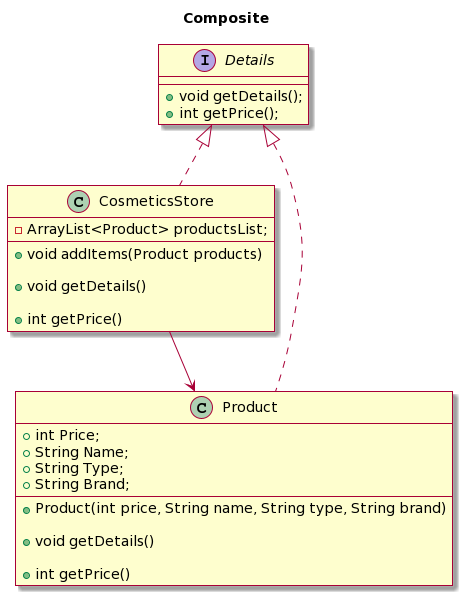

<h2 align="center">🗃 Composite</h2>

Adentrando nos padrões estruturais, encontramos o Composite, definido como aquele padrão voltado à forma como os objetos serão compostos para formar estruturas maiores. Por esse motivo, sua função principal é compor objetos em estrutura de árvore para representar hierarquias (partes/todo). O composite permite aos clientes tratarem de maneira uniforme objetos individuais e composições de objetos. 
 
Nas palavras de Gustavo Bellini Bigardi, "em termos de orientação a objetos, isso significa aplicarmos polimorfismo para chamar métodos de um objeto na árvore sem nos preocuparmos se ele é uma folha ou um composto." 
 
Em termos gerais, podemos dizer que o Composite prioriza a composição ao invés da herança. 

O composite pode ser aplicado nas seguintes hipóteses:

- Quando sua estrutura de objetos puder ser representada hierarquicamente (estruturas do tipo árvore, por exemplo);
- Quando for necessário que um código cliente trate objetos compostos e objetos simples da mesma maneira.

Vantagens:

- Facilita a criação de objetos complexos e a hierarquização de objetos;
- Permite que seja aplicado o polimorfismo, a recursão, bem como a inclusão de novos tipos de elementos na estrutura.

Desvantagens:

- Objetos do tipo leaf tendem a ter métodos que não são usados ou não fazem nada.

Exemplo:

À título de exemplo, o Composite foi empregado em um sistema de loja de cosméticos, no qual a classe Product foi designada como leaf e a interface Details foi responsável por estruturar a classe Produto. Essa lógica pode ser visualizada no diagrama abaixo:

  

## Referências

MIRANDA, Otávio. Composite Teoria - Padrões de Projeto - Parte 14/45. Youtube, 24 de ago. de 2020. Disponível em: <https://www.youtube.com/watch?v=I0RqHDFQjVY>. Acesso em 15 mai. 2023.

BIGARDI, Gustavo Bellini. Arquitetura e desenvolvimento de software — Parte 8 — Composite. Medium, 8 de set. de 2018. Disponível em: <https://gbbigardi.medium.com/arquitetura-e-desenvolvimento-de-software-parte-8-composite-9d342d641a4a>. Acesso em 15 mai. 2023.
