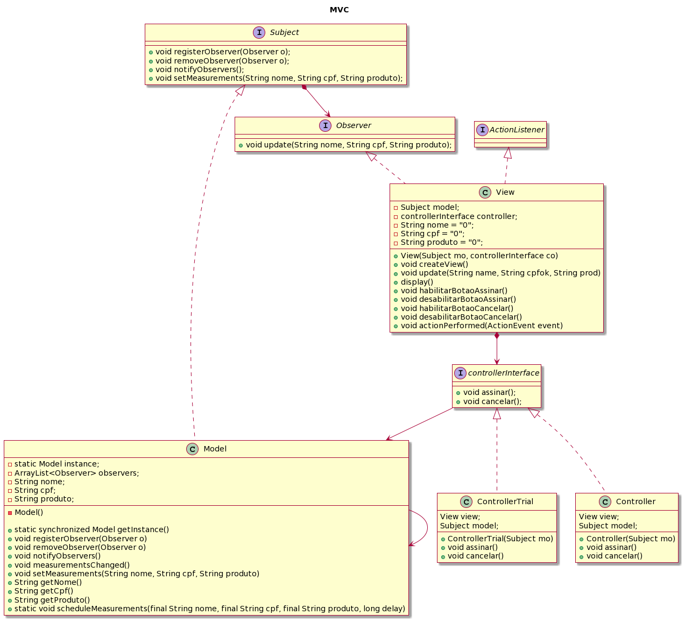

<h2 align="center"> 🤖 MVC </h2>

O MVC é uma sigla em inglês que significa: 

- M – model (modelo);
- V – view (visualização); 
- C – controller (controlador). 

Ou seja, a partir desse padrão, a aplicação é dividida em três camadas: 

- Manipulação dos dados (model); 
- Interação do usuário (view); 
- Camada de controle (controller). 

O conceito do modelo MVC se refere à utilização de uma solução já definida para separar partes distintas do projeto, reduzindo suas dependências ao máximo. Devido à sua arquitetura, que possibilita a divisão do projeto em camadas muito bem definidas, o MVC é utilizado em muitos tipos de projetos atualmente (p. ex., desktop, web e mobile). Cada uma dessas camadas (o Model, o Controller e a View) executa o que lhe é definido e nada mais do que isso. 
 
A principal vantagem na utilização desse padrão de projeto é o isolamento das regras de negócios da lógica de apresentação (interface). Isto possibilita a existência de várias interfaces com o usuário que podem ser modificadas sem a necessidade de alterar as regras de negócios, proporcionando muito mais flexibilidade e oportunidades de reuso das classes. 
 
À título de exemplo, esse padrão foi aplicado a um sistema de cadastro de compras, conforme estrutura ilustrada no diagrama de classes abaixo: 
 

 

Para acessar o código em Java, clique [aqui](https://github.com/laaridiniz/Bertoti/tree/main/EngSoftware_3/MVC/src).

## Referências

DEVMEDIA. Introdução ao Padrão MVC. DevMedia, 2013. Disponível em: <https://www.devmedia.com.br/introducao-ao-padrao-mvc/29308>. Acesso em: 12 de junho de 2023.
