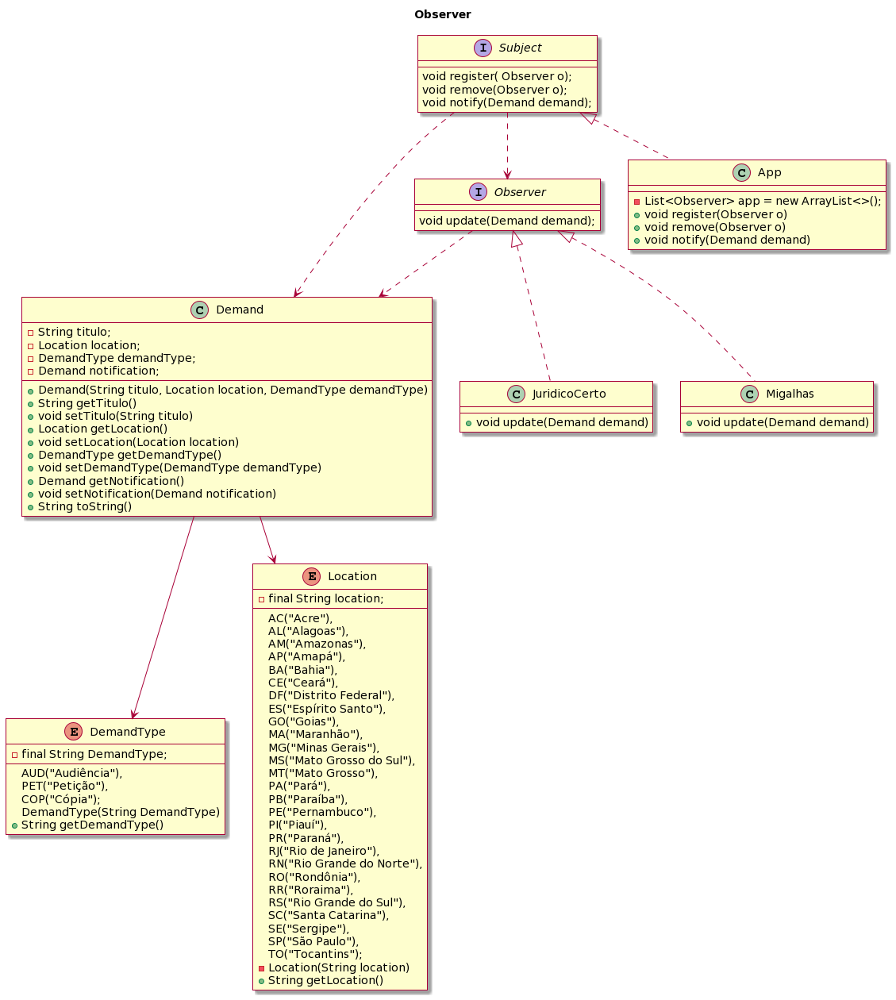

<h1 align="center">👁️ Observer</h1>

O Observer é um padrão de projeto comportamental que parte do princípio da herança e é amplamente utilizado no universo da programação. De acordo com o GoF, "o padrão Observer define uma dependência de um para muitos entre os objetos, em que quando tem-se uma alteração no estado de um objeto, todas as dependências são notificadas e atualizadas automaticamente”.  
 
Esse tipo de padrão é utilizado quando se deseja ser notificado sempre que houver qualquer alteração no estado de um objeto. Neste contexto, o objeto que observa o estado de outro objeto é chamado de Observador/Observer e o objeto que está sendo observado é chamado de Assunto/Subject.  
   
O Assunto/Subject contém uma lista de observadores para notificar quando houver qualquer alteração em seu estado, portanto, deve fornecer métodos pelos quais os observadores possam se registrar e cancelar o registro. O Subject também contém um método para notificar todos os observadores sobre qualquer alteração e pode enviar a atualização enquanto notifica o observador ou pode fornecer outro método para obter a atualização. 
 
Já o Observer deve ter um método para definir o objeto a ser observado e outro método que será usado pelo Subject para notificá-lo sobre qualquer atualização. 
 
A título de exemplo, é possível notar no diagrama abaixo um padrão Observer implementado em um sistema de correspondência jurídica, no qual o Observer define as plataformas de correspondência (Migalhas e Jurídico Certo) como objetos e, caso chegue uma demanda nova, imediatamente aciona o Subject: 
 

  

## Referências

DEVMEDIA. Trabalhando com o Pattern Observer na Plataforma Java EE. DevMedia, 2015. Disponível em: <https://www.devmedia.com.br/trabalhando-com-o-pattern-observer-na-plataforma-java-ee/33149>. Acesso em 05 de jun. de 2023.

DIGITAL OCEAN. Observer Design Pattern in Java. Digital Ocean, 2022. Disponível em: <https://www.digitalocean.com/community/tutorials/observer-design-pattern-in-java>. Acesso em 05 de jun. de 2023.

REFACTORING GURU. Observer em Java. Refactoring Guru, 2023. Disponível em: <https://refactoring.guru/pt-br/design-patterns/observer/java/example>. Acesso em 05 de jun. de 2023.
