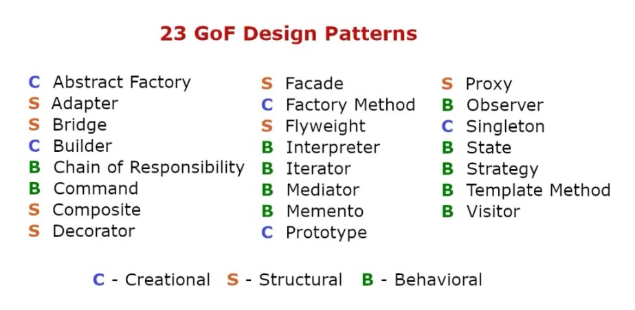

Larissa Aparecida Diniz Silva - RA: 1460482121029

<h2 align="center">🖱️ Uso de Design Patterns na construção dos algoritmos</h2>

Assim como outras áreas das ciências exatas têm diversas teorias aplicadas a problemas típicos, como a relação entre Galileu e a queda livre ou entre Pitágoras e as medidas dos catetos e da hipotenusa, na área da computação também foram desenvolvidas algumas teorias que apresentam uma solução para determinado tipo de problema. Essas fórmulas são os chamados Design Patterns ou Padrões de Projeto, responsáveis por criar soluções para problemas comuns em projetos de software. 
 
Sendo assim, sua aplicação independe da linguagem de programação utilizada, considerando que sua função é resolver da melhor forma um problema recorrente. Ao contrário das funções e bibliotecas, os padrões de projeto não podem ser copiados direto para um programa, por não serem compostos por um trecho de código. Eles são na verdade conceitos que são utilizados como solução e, para serem implementados, o programador precisa seguir o conceito do padrão escolhido, ajustando-o ao problema que precisa ser resolvido. 
 
De acordo com o livro “Design Patterns: Elements of Reusable Object-Oriented Software”, lançado em 1994 e escrito por Rich Gamma, Richard Helm, Ralph Johnson e John Vlissides (conhecidos como GOF ou Gang of Four), existem três principais padrões de projeto: os criacionais, os estruturais e os comportamentais. Essa divisão foi feita a partir da natureza do problema que esses padrões solucionam. 

 

 

Fonte: Pauls Dev Blog, 2022.

 

1) Padrões criacionais: sua função é oferecer alternativas de criação de objetos, melhorando a flexibilidade e a reutilização de código. São citados como principais padrões criacionais o Factory Method, o Abstract Factory e o Builder; 
 
2) Padrões estruturais: como o próprio nome sugere, são voltados à montagem de objetos e classes em estruturas maiores, sem que se comprometa a eficiência e a flexibilidade do código. Os principais padrões estruturais são Adapter, Bridge e Composite; 
 
3) Padrões comportamentais: por fim, esses são os responsáveis por apoiar os programadores em relação ao uso dos algoritmos e à delegação de responsabilidades entre os objetos. Como padrões comportamentais é possível citar Chain of Responsibility, Command e Interpreter. 
 
No entanto, aqui será abordado especialmente o Strategy e o Observer, que são padrões comportamentais. 

## ♟️Strategy 

Quando o algoritmo precisa resolver uma questão que envolve algumas possibilidades é comum que se use uma estrutura condicional, como if else, para tratar essas possibilidades. No entanto, o uso dessa estrutura pode deixar a classe muito extensa. Para resolver esse problema é que surgiu o padrão Strategy, que visa distribuir essas várias possibilidades em classes diferentes, conferindo maior autonomia entre as classes e maior facilidade de leitura, interpretação e manutenção desse código. 
 
Como exemplo, apliquei o padrão Strategy ao cálculo da porcentagem de desconto da contribuição recolhida mensalmente para o INSS, naqueles casos de empregados CLT. Então criei 2 classes: Salario, que define o valor do salário bruto do empregado, e CalculadoraINSS, que faz o cálculo do valor que será descontado do salário bruto do empregado à título de contribuição para a previdência social. Ao invés de criar uma condição para cada faixa de desconto determinada em lei, foi criada a interface Desconto, por meio da qual fiz a referência ao cálculo da porcentagem especificada nas respectivas classes de empregados (Trainee, Desenvolvedor e Diretor). 
 
Usei esses 3 tipos de funções para exemplificar um desconto de 9% (para aqueles têm um salário de contribuição entre R$1.302,00 e R$2.571,29), de 12% (para aqueles têm um salário de contribuição entre R$2.571,30 e R$3.856,94) e de 14% (para aqueles têm um salário de contribuição entre R$3.856,95 e R$7.507,49). 
 
Segue o diagrama de classes que ilustra a estrutura do algoritmo: 

 

## Observer

[Em construção]

## Referências

CHAGAS, Igor. Design patterns: Breve introdução aos padrões de projeto. Alura. Disponível em: <https://www.alura.com.br/artigos/design-patterns-introducao-padroes-projeto>. Acesso em: 09/03/2023.

KNULST, Paul. An Introduction To Software Design Patterns. Pauls Dev Blog. Disponível em: <https://www.paulsblog.dev/an-introduction-to-software-design-patterns/>. Acesso em: 09/03/2023.
