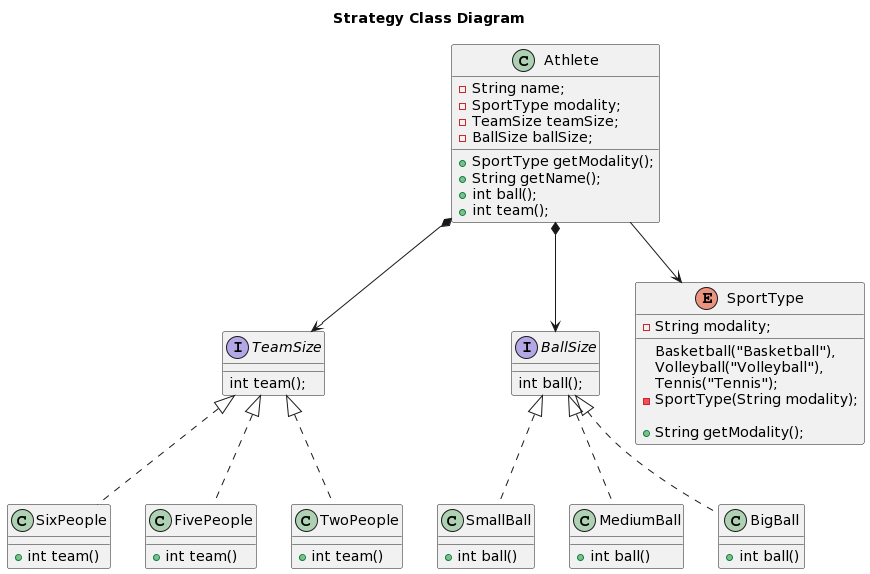

Larissa Aparecida Diniz Silva - RA: 1460482121029

<h2 align="center">Uso de Design Patterns na construção dos algoritmos</h2>

Exemplo: Divisão de esportes de acordo com a quantidade de pessoas na equipe e com o tamanho da bola usada.

