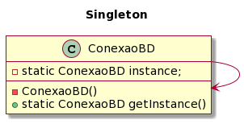

<h2 align="center">📂 Singleton</h2>

Em linhas gerais, o Singleton é um padrão utilizado nos casos em que é necessário uma única instância de determinada classe. 
 
O Singleton pode ser visto de diversas formas dentro de um código, porém, a mais comum delas é instanciar uma classe utilizando um atributo static. Assim, ao definir esse atributo como privado, é possível limitar o acesso a ele apenas dentro da classe em que ele está instanciado. Uma segunda opção seria utilizar o método lazy, a partir do qual utiliza-se um método getInstance para acessar a instância (o método getInstance retorna sempre a mesma instância). 
 
Obs.: Dentro de um cenário de multithread, é possível que o metódo lazy crie mais de uma instância caso haja mais de uma chamada simultânea desse método, uma vez que o Singleton não foi projetado para esse tipo de cenário. Uma alternativa para solucionar essa questão seria utilizar o <b>synchronized</b> no momento de chamar o método getInstance, evitando que o mesmo método seja executado em paralelo. O mais indicado hoje para quem precisa criar uma aplicação em Java utilizando Singleton é trabalhar com Enum. Assim as desvantagens do Singleton, incluindo a questão de multithread, serão automaticamente tratadas pelo próprio Java. 

Vantagens:
- Forma simples e direta de garantir que, para determinado objeto, haja apenas uma instância em memória;
- Evita que o desenvolvedor crie classes e objetos desnecessariamente.

Desvantagens:
- O código que era para se comportar como um padrão Singleton pode acabar sendo usado como variável global (chamada em vários comandos diferentes do mesmo código);
- Dependendo da maneira como é aplicado, o Singleton pode ser difícil de testar a classe que está chamando esse Singleton, já que não é necessário que se passe algum argumento.

A exemplo a aplicabilidade desse padrão, foi construída uma classe genérica responsável por fazer a conexão da aplicação com o banco de dados. Segue o diagrama de classes que ilustra a estrutura do algoritmo:
 

  

## Referências

JÚNIOR, Rinaldo Pitzer. Aprenda PRA VALER o padrão SINGLETON e suas DESVANTAGENS! Youtube, 6 de mai. de 2021. Disponível em: <https://www.youtube.com/watch?v=jInj68kINGE>. Acesso em: 14 mai. 2023.

LIMA, Christian. Padrão Singleton: Como funcionam? Onde vivem? Do que se alimentam? Medium, 11 de jun. de 2019. Disponível em: <https://medium.com/@christianmellolima/padr%C3%A3o-singleton-como-funcionam-onde-vivem-do-que-se-alimentam-6291fb72b22d>. Acesso em: 14 de mai. de 2023.

HIGOR. Padrão de Projeto Singleton em Java. DevMedia, 2012. Disponível em: <https://www.devmedia.com.br/padrao-de-projeto-singleton-em-java/26392>. Acesso em: 14 de mai. de 2023.
