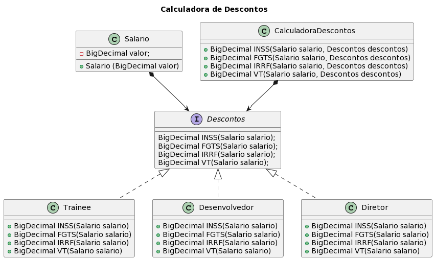

<h2 align="center">Strategy 2</h2>

No exercício anterior, o padrão Strategy foi aplicado ao cálculo da porcentagem de desconto da contribuição recolhida mensalmente para o INSS, naqueles casos de empregados CLT. A partir desse mesmo padrão, foram criadas as classes X, Y e Z. Com isso, além de ter o valor do desconto da contribuição previdenciária de um empregado CLT, também é possível calcular a parcela mensal de FGTS, IRRF e eventual VT usando a interface Desconto. 
 
Segue o diagrama de classes que ilustra a estrutura do algoritmo: 
 

  

