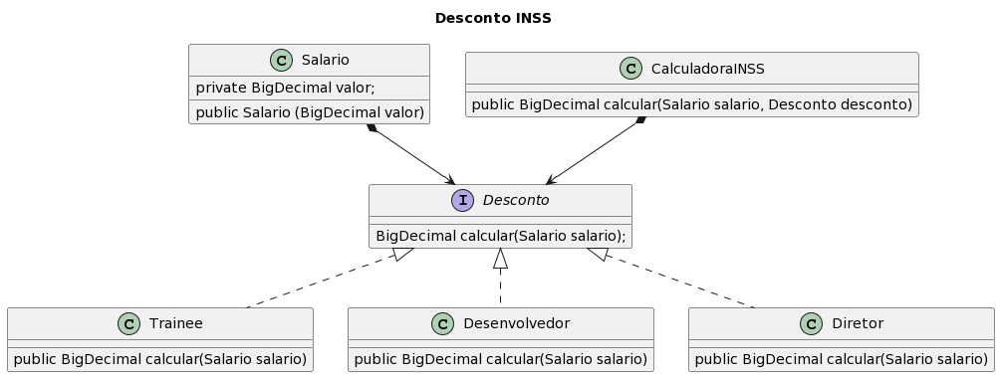

## ♟️Strategy 

Quando o algoritmo precisa resolver uma questão que envolve algumas possibilidades é comum que se use uma estrutura condicional, como if else, para tratar essas possibilidades. No entanto, o uso dessa estrutura pode deixar a classe muito extensa. Para resolver esse problema é que surgiu o padrão Strategy, que visa distribuir essas várias possibilidades em classes diferentes, conferindo maior autonomia entre as classes e maior facilidade de leitura, interpretação e manutenção desse código. 
 
Como exemplo, apliquei o padrão Strategy ao cálculo da porcentagem de desconto da contribuição recolhida mensalmente para o INSS, naqueles casos de empregados CLT. Então criei 2 classes: Salario, que define o valor do salário bruto do empregado, e CalculadoraINSS, que faz o cálculo do valor que será descontado do salário bruto do empregado à título de contribuição para a previdência social. Ao invés de criar uma condição para cada faixa de desconto determinada em lei, foi criada a interface Desconto, por meio da qual fiz a referência ao cálculo da porcentagem especificada nas respectivas classes de empregados (Trainee, Desenvolvedor e Diretor). 
 
Usei esses 3 tipos de funções para exemplificar um desconto de 9% (para aqueles têm um salário de contribuição entre R$1.302,00 e R$2.571,29), de 12% (para aqueles têm um salário de contribuição entre R$2.571,30 e R$3.856,94) e de 14% (para aqueles têm um salário de contribuição entre R$3.856,95 e R$7.507,49). 
 
Segue o diagrama de classes que ilustra a estrutura do algoritmo: 

 

Para acessar o código em Java, clique [aqui](https://github.com/laaridiniz/Bertoti/tree/main/EngSoftware_3/Strategy).
