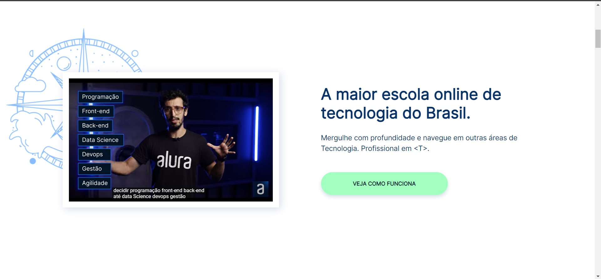
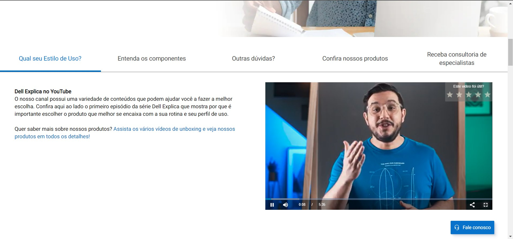
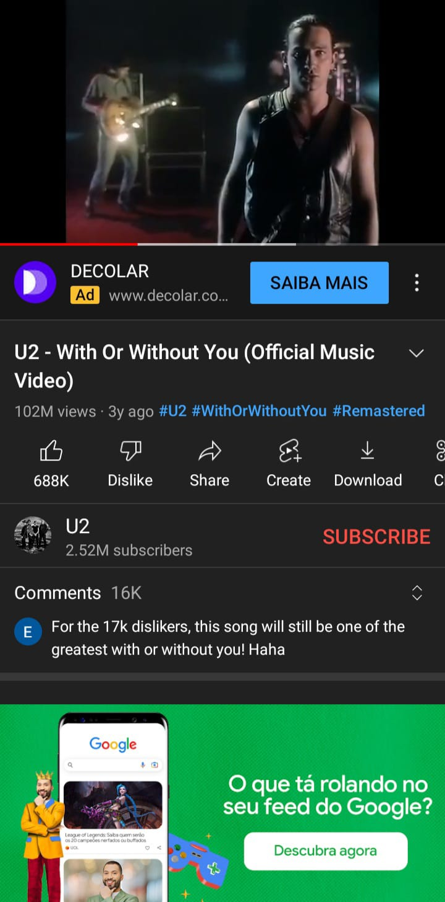
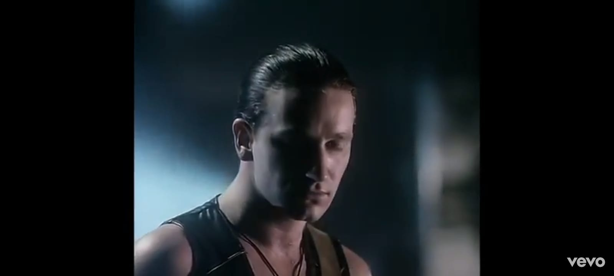
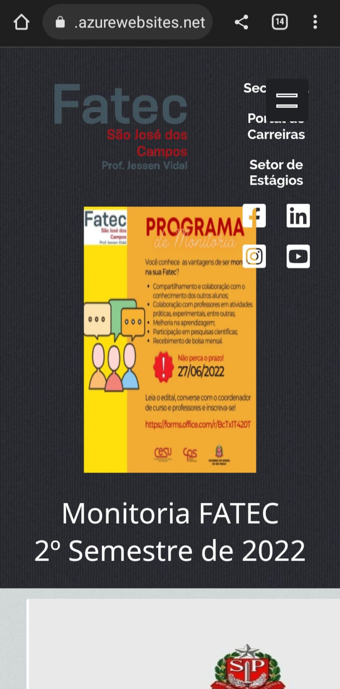
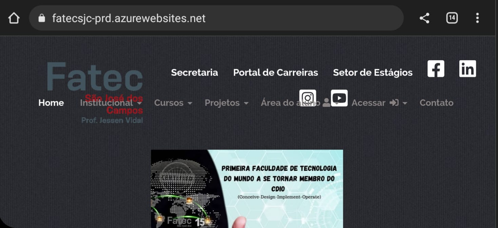
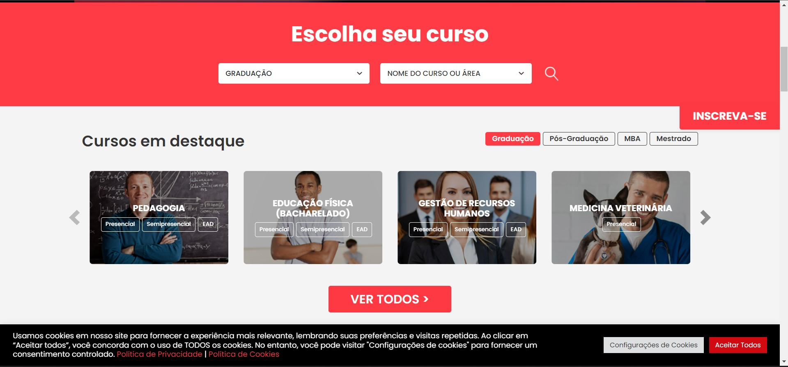
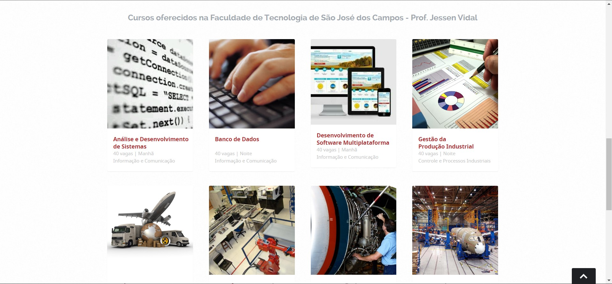

Larissa Aparecida Diniz Silva - RA: 1460482121029
 
[Em construção]

<h1 align="center">Análise das Diretrizes de Acessibilidade de Conteúdo da Web (WCAG)</h1>

 

  <a href="#ap">Introduction</a>&nbsp;&nbsp;&nbsp;|&nbsp;&nbsp;&nbsp;
  <a href="#principio1">Principle 1 - Perceivable</a>&nbsp;&nbsp;&nbsp;|&nbsp;&nbsp;&nbsp;
  <a href="#principio2">Principle 2 - Operable</a>&nbsp;&nbsp;&nbsp;|&nbsp;&nbsp;&nbsp;
  <a href="#principio3">Principle 3 - Understandable</a>&nbsp;&nbsp;&nbsp;|&nbsp;&nbsp;&nbsp;
  <a href="#principio4">Principle 4 - Robust</a>&nbsp;&nbsp;&nbsp;|&nbsp;&nbsp;&nbsp;
  <a href="#dev">Dev</a>

## ✨Introduction

Atividade proposta na aula de 24/08/2022, como requisito de avaliação da disciplina Interação Humano-Computador, que compõe a grade curricular do curso de Análise e Desenvolvimento de Sistemas da FATEC-SJC.

  
  ## 🖥 Principle 1 - Perceivable

  
A partir deste princípio, as informações e os componentes da interface do usuário devem ser apresentáveis aos usuários de maneira que eles possam perceber. Esse princípio é dividido em quatro subprincípios: alternativas de texto, mídia baseada em tempo, adaptável e distinguível.   
<b> A) Alternativas de texto: </b>
 

Forneça alternativas de texto para qualquer conteúdo que não seja de texto para que possa ser alterado para outras formas que as pessoas precisem, como letras grandes, braille, fala, símbolos ou linguagem mais simples. 
     
 

 

 

  
 

  
  
Imagens exibidas na página durante a navegação.

   
  
 

  
 

  
  
 ✅ Exibição do texto alternativo de cada uma das imagens (Dell).

  
   
  <b> B) Mídia baseada em tempo: </b>
   

  
Quando se fala em mídia baseada em tempo ou <i>time-based media</i> é necessário ter em mente a ideia de tecnologias de vídeo, filme, slide, áudio, e todas aquelas que têm duração como dimensão e se desdobram para o espectador ao longo do tempo (Guggenheim, 2022). Nesses casos, o ideal é que sejam fornecidas alternativas para esse tipo de mídia, como legendas, língua de sinais, autodescrição etc. 
     
 

 

 
 

  
 

 
 ✅ Exibição de legendas e recursos visuais para enfatizar a mensagem (Alura).

   
 
 

  
 

 
 ❌ Mídia sem opção de legendas (Dell).

   
 
 <b> C) Adaptável: </b>
  

 
 
Crie conteúdo que possa ser apresentado de diferentes formas sem perder informações ou estrutura.
  

 

 
 

  
 

 
 ✅ A plataforma exibe de forma satisfatória o conteúdo tanto para desktop quanto para mobile (Youtube).

   
  
  

  
 

 
 ✅ Independentemente da orientação do dispositivo (Youtube).

   
 
 

  
 

 
 ❌ Conteúdo do site se adapta bem ao navegador do Desktop (Fatec).

   

  
 

 
 ❌ Mas quando acessado por dispositivos móveis, os elementos se sobrepõem (Fatec).

   
  
  

  
 

 
 ❌ Até mesmo na orientação paisagem (Fatec).

   

<b> D) Distinguível: </b>
     
 
Torne mais fácil para os usuários ver e ouvir o conteúdo, incluindo a separação do primeiro plano do plano de fundo.
  
 

 

 
 

  
 

 
 ✅ Alto contraste entre a fonte e o plano de fundo (FMU).

   
 
 

  
 

 
 ❌ Baixo contraste entre a fonte e o plano de fundo (Fatec).

   

→ [Voltar ao topo](#topo)

 ## 💻 Principle 2 - Operable
  

De acordo com esse princípio, os componentes da interface do usuário e a navegação devem ser operáveis. Para isso, é necessário se atentar a cinco elementos fundamentais que são divididos nos seguintes tópicos: teclado acessível, tempo suficiente, reações físicas, navegabilidade e modalidades de entrada. 
   
  

 

→ [Voltar ao topo](#topo)

 

  
> Larissa Diniz, 2022 :star2:  
> ❤️ [Github](https://github.com/laaridiniz) 
> 💙 [LinkedIn](https://www.linkedin.com/in/larissa-diniz-dev/) 

→ [Voltar ao topo](#topo)
