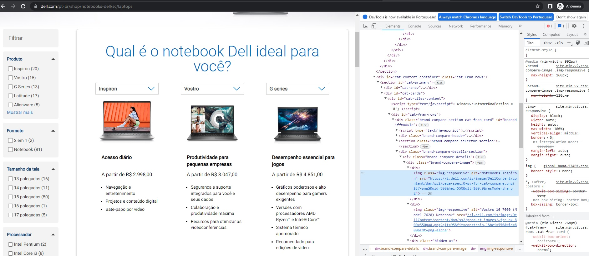
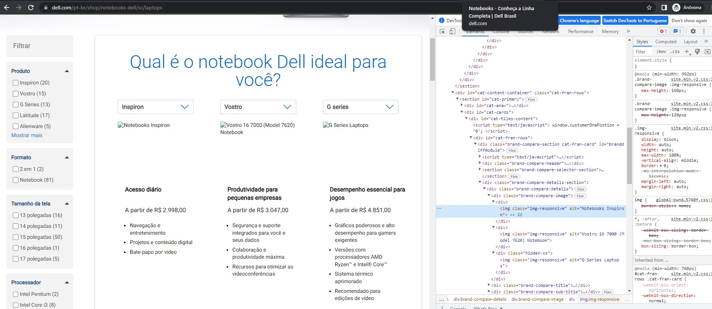

Larissa Aparecida Diniz Silva - RA: 1460482121029

<h1 align="center">Análise das Diretrizes de Acessibilidade de Conteúdo da Web (WCAG)</h1>

 

  <a href="#ap">Apresentação</a>&nbsp;&nbsp;&nbsp;|&nbsp;&nbsp;&nbsp;
  <a href="#principio1">Principle 1 - Perceivable</a>&nbsp;&nbsp;&nbsp;|&nbsp;&nbsp;&nbsp;
  <a href="#principio2">Principle 2 - Operable</a>&nbsp;&nbsp;&nbsp;|&nbsp;&nbsp;&nbsp;
  <a href="#principio3">Principle 3 - Understandable</a>&nbsp;&nbsp;&nbsp;|&nbsp;&nbsp;&nbsp;
  <a href="#principio4">Principle 4 - Robust</a>&nbsp;&nbsp;&nbsp;|&nbsp;&nbsp;&nbsp;

## ✨Apresentação

Atividade proposta na aula de 24/08/2022, como requisito de avaliação da disciplina Interação Humano-Computador, que compõe a grade curricular do curso de Análise e Desenvolvimento de Sistemas da FATEC-SJC.

  
  ## 🖥 Principle 1 - Perceivable

  
As informações e os componentes da interface do usuário devem ser apresentáveis aos usuários de maneira que eles possam perceber. 
 Esse princípio é dividido em quatro subprincípios: alternativas de texto, mídia baseada em tempo, adaptável e distinguível.   
    <b> A) Alternativas de texto: </b>
     
      Forneça alternativas de texto para qualquer conteúdo que não seja de texto para que possa ser alterado para outras formas que as pessoas precisem, como letras grandes, braille, fala, símbolos ou linguagem mais simples. 
     
 

 

 

  
   
  

  
   
  <b> B) Mídia baseada em tempo: </b>
     
    
Forneça alternativas para mídia baseada em tempo. 
     
 

 

 
 

  
  
 

  
 
 <b> C) Adaptável: </b>
     
    
Crie conteúdo que possa ser apresentado de diferentes formas (por exemplo, layout mais simples) sem perder informações ou estrutura. 
     
 

 

 
 

  
  
 

<b> D) Distinguível: </b>
     
    
Torne mais fácil para os usuários ver e ouvir o conteúdo, incluindo a separação do primeiro plano do plano de fundo. 
     
 

 

 
 

  
  

→ [Voltar ao topo](#topo)

 ## 💻 Principle 2 - Operable
  

Na hora de planejar e elaborar um software o ideal é criar um diagrama de classes, pois é essa ferramenta que traz a representação da estrutura e das relações das classes que servem de modelo para os objetos. 
 Identificando os objetos e encontrando suas respectivas classes, automaticamente é possível obter a tabela do banco de dados, daí a importância do diagrama de classes nesse momento. Esse processo é tecnicamente definido como abstração dentro da programação orientada a objetos (POO). 
   
  

  

  

  
   
   

→ [Voltar ao topo](#topo)

