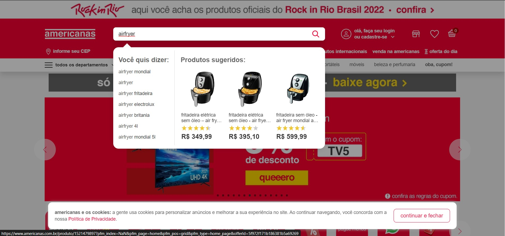
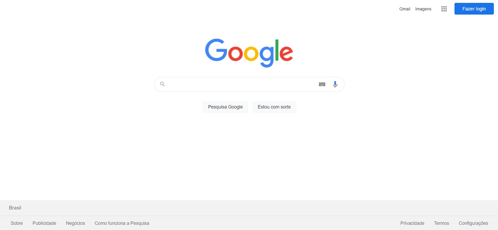
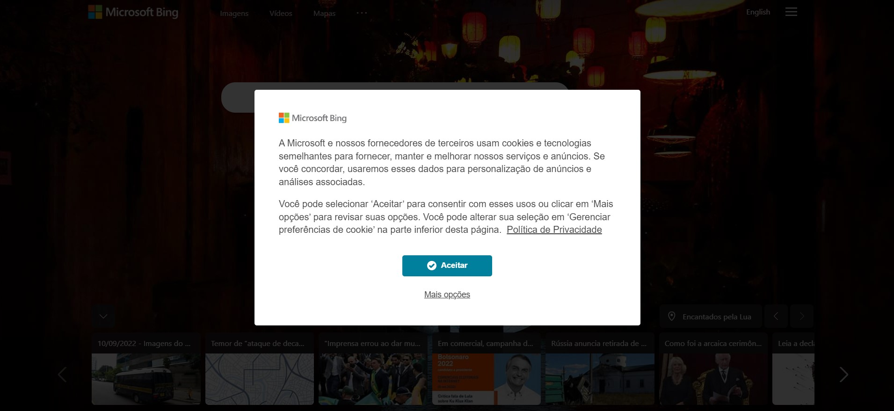
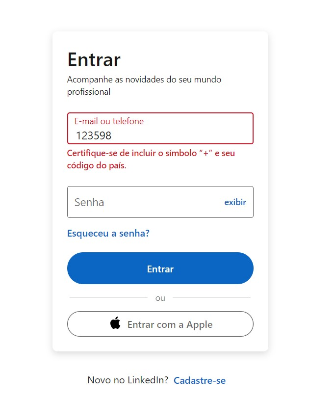
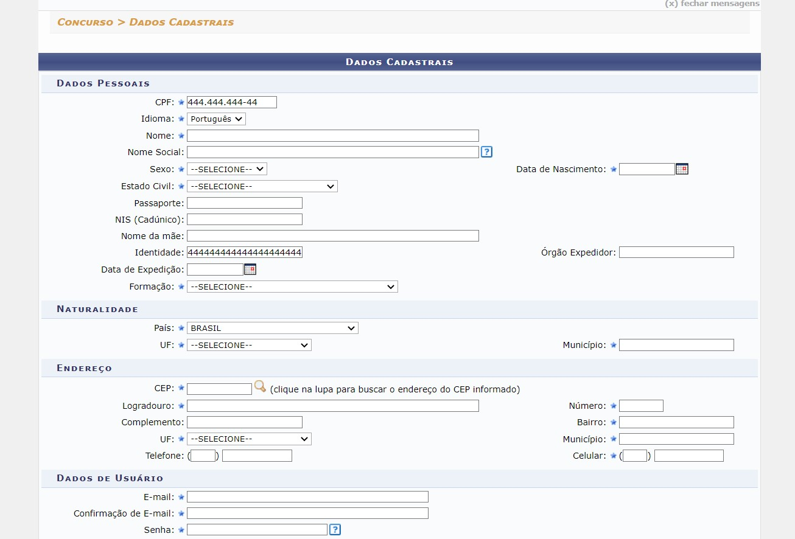
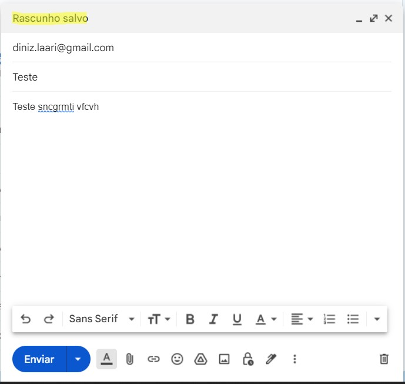
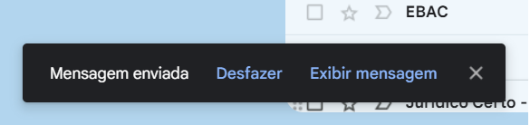

Larissa Aparecida Diniz Silva - RA: 1460482121029
 
[Em construção]

<h1 align="center">Análise das Diretrizes de Acessibilidade de Conteúdo da Web (WCAG)</h1>

 

  <a href="#intro">Introduction</a>&nbsp;&nbsp;&nbsp;|&nbsp;&nbsp;&nbsp;
  <a href="#principioum">Principle 1</a>&nbsp;&nbsp;&nbsp;|&nbsp;&nbsp;&nbsp;
  <a href="#principiodois">Principle 2</a>&nbsp;&nbsp;&nbsp;|&nbsp;&nbsp;&nbsp;
  <a href="#principiotres">Principle 3</a>&nbsp;&nbsp;&nbsp;|&nbsp;&nbsp;&nbsp;
  <a href="#principioquatro">Principle 4</a>&nbsp;&nbsp;&nbsp;|&nbsp;&nbsp;&nbsp;
  <a href="#dev">Dev</a>

## ✨Introduction

Atividade proposta na aula de 24/08/2022, como requisito de avaliação da disciplina Interação Humano-Computador, que compõe a grade curricular do curso de Análise e Desenvolvimento de Sistemas da FATEC-SJC.

  
## 🖥 Principle 1 - Perceivable
  

A partir deste princípio, as informações e os componentes da interface do usuário devem ser apresentáveis aos usuários de maneira que eles possam perceber. Esse princípio é dividido em quatro subprincípios: alternativas de texto, mídia baseada em tempo, adaptável e distinguível.   
<b> A) Alternativas de texto: </b>
 

Forneça alternativas de texto para qualquer conteúdo que não seja de texto para que possa ser alterado para outras formas que as pessoas precisem, como letras grandes, braille, fala, símbolos ou linguagem mais simples. 
 

  

  

Imagens exibidas na página durante a navegação.

 
  

  

  

 ✅ Exibição do texto alternativo de cada uma das imagens (Dell).

 
<b> B) Mídia baseada em tempo: </b>
 

Quando se fala em mídia baseada em tempo ou <i>time-based media</i> é necessário ter em mente a ideia de tecnologias de vídeo, filme, slide, áudio, e todas aquelas que têm duração como dimensão e se desdobram para o espectador ao longo do tempo (Guggenheim, 2022). Nesses casos, o ideal é que sejam fornecidas alternativas para esse tipo de mídia, como legendas, língua de sinais, autodescrição etc. 
 

 

  

 
 ✅ Exibição de legendas e recursos visuais para enfatizar a mensagem (Alura).

   
 
 

  
 

 
 ❌ Mídia sem opção de legendas (Dell).

   
 
 <b> C) Adaptável: </b>
  

 
 
Crie conteúdo que possa ser apresentado de diferentes formas sem perder informações ou estrutura.
  

 
 

  
 

 
 ✅ A plataforma exibe de forma satisfatória o conteúdo tanto para desktop quanto para mobile (Youtube).

   
  
  

  
 

 
 ✅ Independentemente da orientação do dispositivo (Youtube).

   
 
 

  
 

 
 ❌ Conteúdo do site se adapta bem ao navegador do Desktop (Fatec).

   

  
 

 
 ❌ Mas quando acessado por dispositivos móveis, os elementos se sobrepõem (Fatec).

   
  

  

 ❌ Até mesmo na orientação paisagem (Fatec).

   

<b> D) Distinguível: </b>
     
 
Torne mais fácil para os usuários ver e ouvir o conteúdo, incluindo a separação do primeiro plano do plano de fundo.
  
 

 
 

  
 

 
 ✅ Alto contraste entre a fonte e o plano de fundo (FMU).

   
 
 

  
 

 
 ❌ Baixo contraste entre a fonte e o plano de fundo (Fatec).

   

→ [Voltar ao topo](#topo)

## 🕹️ Principle 2 - Operable

Por força deste princípio, os componentes da interface do usuário e a navegação devem ser operáveis, de acordo com os itens abaixo: 
 
<b> A) Teclado acessível: </b>
 

Sempre que possível, disponibilize a opção de operar por meio de um teclado.
  

  
 

 

 ✅ Usando apenas algumas teclas, é possível pesquisar produtos e navegar pelas páginas do site (Americanas).

   
 
<b> B) Tempo suficiente: </b>
 

O ideal é que se forneça aos usuários tempo suficiente para ler e usar conteúdo. Então, informações móveis que começam automaticamente devem contar com um mecanismo para que o usuário possa pausar, parar ou escondê-lo. Exemplo desse caso são os termos de privacidade dos sites que, após a entrada em vigor da LGPD, passaram a obrigar a transparência dos sites em relação ao tratamento dos dados do usuário. O ideal é que esses avisos não atrapalhem a navegação do usuário, porém, ainda há algumas páginas que renderizam esse tipo de informação de uma maneira que obriga o usuário a tomar algum tipo de ação para só então poder navegar naquele site.
 

  

 

 ✅ Em determinados buscadores online, o usuário não fica impedido de usar alguma funcionalidade e ainda tem uma opção específica disponível para acessar a política de privacidade e outras informações relevantes (Google).

 
  

  

 ❌ Algumas páginas ainda exibem avisos de uso de dados do usuário que o impedem de navegar no site sem antes configurar as permissões desejadas (Bing).

 

→ [Voltar ao topo](#topo)

## 🧠 Principle 3 - Undestandable

Tendo em vista esse princípio, as informações e o funcionamento da interface do usuário devem ser compreensíveis, ou seja, deve ser legível, previsível e navegável. Ou seja, as páginas da Web precisam aparecer e operar de maneira previsível, contando com textos legíveis e compreensíveis, além de recursos que ajudem os usuários a evitar e corrigir erros, conforme mostrado a seguir: 

  
 

 

 ✅ Alguns campos de input contam com validações que auxiliam o usuário a identificar que tipo de informação deve ser fornecida. (LinkedIn).

   

  

 ❌ Alguns sistemas ainda não contam com máscaras em determinados campos de formulários. No formulário acima, vemos que o campo CPF contém uma limitação e uma configuração para os inputs do usuário, enquanto que no campo IDENTIDADE isso não ocorre, então, o usuário pode acidentalmente registrar informações equivocadas (Cefet-MG).

→ [Voltar ao topo](#topo)

## 🧩 Principle 4 - Robust

A partir desse princípio, o conteúdo deve ser robusto o suficiente para que possa ser interpretado por uma grande variedade de agentes do usuário, incluindo tecnologias assistivas. Essa heurística está ligada à maximização da compatibilidade com agentes de usuário atuais e futuros, incluindo tecnologias assistivas, como ocorre, por exemplo, com as mensagens de status do sistema, que atualizam o usuário do que está sendo feito no sistema: 
 

  
 

 

 ✅ Enquanto o usuário redige um e-mail, a plataforma notifica o usuário do status do rascunho. (Gmail).

   

  
 

 

 ✅ Assim que o usuário envia um e-mail, a plataforma notifica o usuário. (Gmail).

   

  
> Larissa Diniz, 2022 :star2:  
> ❤️ [Github](https://github.com/laaridiniz) 
> 💙 [LinkedIn](https://www.linkedin.com/in/larissa-diniz-dev/) 

→ [Voltar ao topo](#topo)
